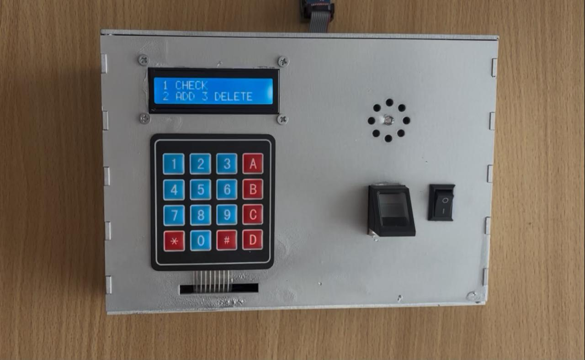
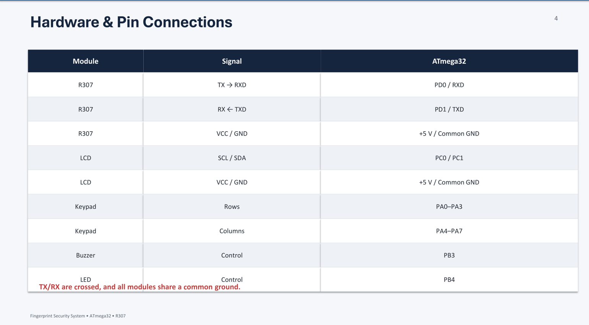

# 🔐 ATmega32 Fingerprint Security System

> An embedded security system based on the **ATmega32 microcontroller** that uses the **R307 fingerprint sensor** for user authentication, an **I2C LCD** for system feedback, a **keypad** for user interaction, and a **buzzer/LED** for system indications.

---

## 📌 Table of Contents

* [Project Overview](#-project-overview)
* [Project Objectives](#-project-objectives)
* [Key Features](#-key-features)
* [System Architecture](#-system-architecture)
* [System Workflow](#-system-workflow)
* [Hardware Components](#-hardware-components)
* [Hardware Connections](#-hardware-connections)
* [Communication Protocols](#-communication-protocols)
* [Software Architecture](#-software-architecture)
* [Authentication Process](#-authentication-process)
* [Project Structure](#-project-structure)
* [Development Tools](#-development-tools)
* [Simulation](#-simulation)
* [How to Build and Run](#-how-to-build-and-run)
* [Project Documentation](#-project-documentation)
* [Team](#-team)
* [Supervision](#-supervision)
* [Future Improvements](#-future-improvements)
* [License](#-license)

---

# 📖 Project Overview

The **ATmega32 Fingerprint Security System** is an embedded access-control project developed using the **ATmega32 microcontroller**.

The system uses an **R307 fingerprint sensor** to authenticate users. The fingerprint sensor communicates with the ATmega32 through **UART**, while an **I2C LCD** provides visual feedback to the user.

A **keypad** is used for user interaction, while a **buzzer and LED indicators** provide system status and security indications.

The project was designed using a modular embedded-systems architecture, separating low-level microcontroller drivers (**MCAL**) from hardware abstraction drivers (**HAL**) and the main application logic.

---

# 🎯 Project Objectives

The main objectives of the project are:

* Implement a fingerprint-based authentication system.
* Interface an **R307 fingerprint sensor** with the ATmega32.
* Establish reliable **UART communication** between the microcontroller and fingerprint sensor.
* Interface an LCD using the ATmega32's **TWI/I2C** peripheral.
* Provide user interaction through a keypad.
* Implement authentication and fingerprint identification logic.
* Limit the number of unsuccessful authentication attempts.
* Provide visual and audible feedback for authentication results.
* Apply a modular and reusable embedded software architecture.
* Test the system using embedded-system simulation and hardware components.

---

# ✨ Key Features

### 🔐 Fingerprint Authentication

The R307 fingerprint module is used to identify registered users and determine whether the presented fingerprint belongs to an authorized user.

### 👥 Registered Users

The application maintains fingerprint IDs associated with registered users.

The current application database includes:

| Fingerprint ID | User         |
| -------------: | ------------ |
|              1 | Nour         |
|              2 | Fatma        |
|              3 | Jana         |
|              4 | Eng. Fared   |
|              5 | Eng. Mostafa |

> The names above correspond to the current application configuration and can be changed according to the registered fingerprints.

### 🔢 Limited Authentication Attempts

The system allows a maximum of **3 authentication attempts**.

After an unsuccessful attempt, the remaining number of trials is decreased.

When the maximum number of unsuccessful attempts is reached, the system activates the buzzer as a security indication.

### 🖥️ LCD Interface

The LCD provides the user with information and instructions throughout the authentication process.

The LCD is connected through an **I2C interface**, reducing the number of microcontroller pins required for LCD communication.

### 🔢 Keypad Interface

A keypad provides user input and allows interaction with the system.

### 🔊 Security Indication

A buzzer is used to indicate security-related events, particularly unsuccessful authentication after the allowed attempts have been exhausted.

An LED is also used as a system indicator.

---

# 🧩 System Architecture

The overall system can be represented as:

```text
                       ┌─────────────────────┐
                       │       ATmega32      │
                       │   Main Controller   │
                       └──────────┬──────────┘
                                  │
              ┌───────────────────┼───────────────────┐
              │                   │                   │
              ▼                   ▼                   ▼
       ┌─────────────┐     ┌─────────────┐     ┌─────────────┐
       │    R307     │     │  I2C LCD    │     │   Keypad    │
       │ Fingerprint │     │   Display   │     │    Input    │
       │   Sensor    │     └─────────────┘     └─────────────┘
       └──────┬──────┘
              │
             UART
              
              ┌─────────────────────────────────────────┐
              │                                         │
              ▼                                         ▼
       ┌─────────────┐                           ┌─────────────┐
       │    Buzzer   │                           │     LED     │
       │   Security  │                           │  Indicator  │
       │  Indication │                           │             │
       └─────────────┘                           └─────────────┘
```

---

# 🔄 System Workflow

The general authentication process follows this sequence:

```text
                    ┌──────────────┐
                    │    START     │
                    └──────┬───────┘
                           │
                           ▼
              ┌────────────────────────┐
              │ Initialize ATmega32    │
              │ DIO / UART / TWI       │
              │ Timer / Peripherals    │
              └────────────┬───────────┘
                           │
                           ▼
              ┌────────────────────────┐
              │      System Menu       │
              │      / LCD Display     │
              └────────────┬───────────┘
                           │
                           ▼
              ┌────────────────────────┐
              │ Place Finger on R307   │
              └────────────┬───────────┘
                           │
                           ▼
              ┌────────────────────────┐
              │ Fingerprint Search /   │
              │ Identification         │
              └────────────┬───────────┘
                           │
                     ┌─────┴─────┐
                     │           │
                   MATCH       NO MATCH
                     │           │
                     ▼           ▼
              ┌────────────┐ ┌───────────────┐
              │   ACCESS   │ │ Decrease      │
              │  GRANTED   │ │ Trial Counter │
              └────────────┘ └───────┬───────┘
                                     │
                               ┌─────┴─────┐
                               │           │
                         Trials > 0    Trials = 0
                               │           │
                               ▼           ▼
                         ┌──────────┐  ┌──────────┐
                         │ Try Again│  │  Buzzer  │
                         └──────────┘  └──────────┘
```

---

# 🔧 Hardware Components

| Component                   | Function                                   |
| --------------------------- | ------------------------------------------ |
| **ATmega32**                | Main microcontroller and system controller |
| **R307 Fingerprint Sensor** | Fingerprint enrollment/identification      |
| **I2C LCD**                 | Displays system messages and user feedback |
| **Keypad**                  | User input                                 |
| **Buzzer**                  | Security and failed-attempt indication     |
| **LED**                     | System status indication                   |
| **Power Supply**            | Provides power to the system               |

---

# 🔌 Hardware Connections

## R307 Fingerprint Sensor

The R307 communicates with the ATmega32 using **UART**.

```text
R307
 │
 └── UART ───────────► ATmega32
```

The UART configuration used by the project is:

```text
Baud Rate : 57600
Data Bits : 8
Parity    : None
Stop Bits : 1
```

---

## I2C LCD

The LCD communicates with the ATmega32 through the **TWI/I2C** peripheral.

The current project uses:

```text
ATmega32
   │
   ├── PC1 ─── SDA
   │
   └── PC0 ─── SCL
```

The LCD configuration uses the I2C address:

```text
0x27
```

---

## Keypad

The keypad is connected to the ATmega32 through the DIO interface.

The keypad driver handles scanning the rows and columns and returns the corresponding pressed key to the application.

---

# 📡 Communication Protocols

## UART

UART is used for communication between the **ATmega32 and R307 fingerprint sensor**.

The project uses:

```text
Baud Rate : 57600
```

The UART driver belongs to the **MCAL layer** and provides the low-level serial communication functions required by the R307 driver.

---

## TWI / I2C

The LCD communicates with the ATmega32 using the **TWI/I2C peripheral**.

The TWI driver provides the low-level I2C communication, while the LCD driver uses it to control the display.

```text
Application
     │
     ▼
LCD Driver
     │
     ▼
TWI Driver
     │
     ▼
ATmega32 TWI Peripheral
     │
     ▼
I2C LCD
```

---

# 💻 Software Architecture

The project follows a layered embedded-systems architecture.

```text
┌───────────────────────────────────┐
│          APPLICATION              │
│             main.c                │
└─────────────────┬─────────────────┘
                  │
                  ▼
┌───────────────────────────────────┐
│              HAL                  │
│                                   │
│   LCD     Keypad     R307          │
└─────────────────┬─────────────────┘
                  │
                  ▼
┌───────────────────────────────────┐
│              MCAL                 │
│                                   │
│ DIO    UART    TWI    TIMER       │
└─────────────────┬─────────────────┘
                  │
                  ▼
┌───────────────────────────────────┐
│             ATmega32              │
│          Microcontroller           │
└───────────────────────────────────┘
```

---

## MCAL — Microcontroller Abstraction Layer

The MCAL contains the low-level drivers responsible for interacting directly with the ATmega32 peripherals.

### DIO

Handles digital input/output operations.

### UART

Handles serial communication between the ATmega32 and R307.

### TWI

Provides I2C/TWI communication used by the LCD.

### TIMER

Provides timer functionality required by the application and system timing.

---

# 🧩 HAL — Hardware Abstraction Layer

The HAL contains drivers for external hardware modules.

### R307 Driver

Handles communication with the R307 fingerprint sensor and provides the functionality required by the application for fingerprint operations.

### LCD Driver

Controls the LCD through the I2C/TWI interface.

### Keypad Driver

Handles keypad scanning and user input.

---

# 🔐 Authentication Process

The authentication system operates using a limited number of attempts.

The current configuration defines:

```c
#define MAX_TRIALS 3
```

### Successful Authentication

When the fingerprint matches a registered fingerprint:

```text
Fingerprint
     ↓
R307 Search
     ↓
Fingerprint Found
     ↓
Retrieve Fingerprint ID
     ↓
Identify User
     ↓
Access Granted
```

The corresponding user's name can then be displayed on the LCD.

### Failed Authentication

If the fingerprint does not match:

```text
Fingerprint
     ↓
R307 Search
     ↓
No Match
     ↓
Decrease Trials
     ↓
Display Remaining Trials
```

If all three attempts are unsuccessful:

```text
3 Failed Attempts
       ↓
   Buzzer ON
```

---

# 📂 Project Structure

```text
ATmega32-Fingerprint-Security-System/
│
├── HAL/
│   ├── KEYPAD/
│   ├── LCD/
│   └── R307/
│
├── MCAL/
│   ├── DIO/
│   ├── TIMER/
│   ├── TWI/
│   └── UART/
│
├── firmware/
│   └── Fingerprint_Security_System.hex
│
├── docs/
│   ├── project-presentation.pdf
│   ├── system-architecture.png
│   ├── authentication-flowchart.png
│   ├── circuit-diagram.png
│   └── proteus-simulation.png
│
├── main.c
├── STD_TYPES.h
├── BIT_MATH.h
├── .project
├── .cproject
├── .gitignore
├── README.md
└── LICENSE
```

---

# 🛠️ Development Tools

The project was developed using:

* **Embedded C**
* **ATmega32**
* **AVR-GCC**
* **Eclipse**
* **Proteus**
* **UART**
* **TWI / I2C**
* **R307 Fingerprint Sensor**

---

# 🧪 Simulation

The system can be tested using **Proteus** with the compiled ATmega32 firmware.

The simulation can be used to verify:

* ATmega32 operation
* LCD communication
* Keypad input
* System logic
* Indicators
* Application behavior

Project simulation screenshots will be included in the `docs/` directory.

---

# 🚀 How to Build and Run

## 1. Clone the Repository

```bash
git clone https://github.com/YOUR-USERNAME/ATmega32-Fingerprint-Security-System.git
```

## 2. Open the Project

Open the project using **Eclipse** with the AVR-GCC toolchain configured.

## 3. Build the Project

Build the project from Eclipse.

The generated firmware can be used to program the ATmega32 or loaded into the corresponding Proteus simulation.

## 4. Connect the Hardware

Connect:

* ATmega32
* R307 fingerprint sensor
* I2C LCD
* Keypad
* Buzzer
* LED

according to the project's hardware configuration.

## 5. Test Authentication

Enroll the required fingerprints in the R307 and test the identification process.

---

# 📚 Project Documentation

Additional project documentation, diagrams, and presentation material will be available in:

```text
docs/
```

This section will include:

* System block diagram
* Authentication flowchart
* Circuit diagram
* Proteus simulation
* Hardware photographs
* Project presentation

---

# 👥 Team

This project was developed collaboratively by:

### 👩‍💻 Fatma Mahmoud

### 👩‍💻 Jana Mahdy

### 👩‍💻 Nour Khaled

---

# 👨‍🏫 Supervision

The project was completed under the supervision of:

**Eng. Mahmoud Fared**

**Eng. Mostafa Aladly**

---

# 🔮 Future Improvements

Potential future improvements include:

* Adding a larger fingerprint database.
* Implementing fingerprint enrollment directly through the user interface.
* Adding EEPROM-based storage for user information.
* Adding an RTC for time-stamped access records.
* Adding an external communication interface for monitoring.
* Implementing a more advanced access log.
* Adding additional security/authentication methods.

---

# 📄 License

This project is licensed under the **MIT License**.

See the [LICENSE](LICENSE) file for more information.

---

## ⭐ Acknowledgment

We would like to thank our supervisors, **Eng. Mahmoud Fared** and **Eng. Mostafa Aladly**, for their guidance and support throughout the development of this project.

We would also like to acknowledge the collaborative effort of **Fatma Mahmoud, Jana Mahdy, and Nour Khaled** in designing, implementing, testing, and documenting the system.
